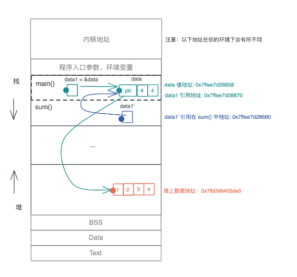
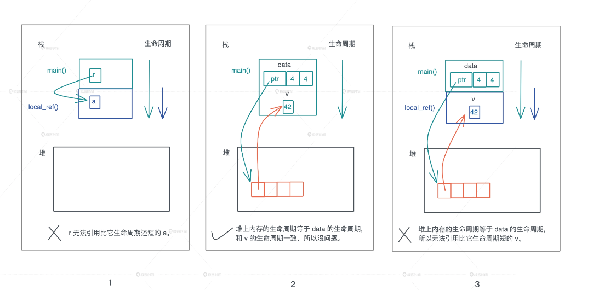
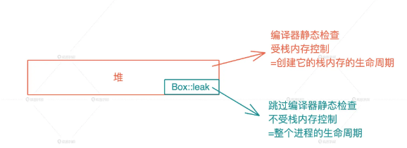

# 所有权


值的生杀大权可以共享还是需要独占。


Rust 给出了如下规则：

- 一个值只能被一个变量所拥有，这个变量被称为所有者（Each value in Rust has a variable that’s called its owner）。
- 一个值同一时刻只能有一个所有者（There can only be one owner at a time），也就是说不能有两个变量拥有相同的值。所以对应刚才说的变量赋值、参数传递、函数返回等行为，旧的所有者会把值的所有权转移给新的所有者，以便保证单一所有者的约束。
- 当所有者离开作用域，其拥有的值被丢弃（When the owner goes out of scope, the value will be dropped），内存得到释放。


## 方案

- 如果你不希望值的所有权被转移，在 Move 语义外，Rust 提供了 Copy 语义。如果一个数据结构实现了 Copy trait，那么它就会使用 Copy 语义。这样，在你赋值或者传参时，值会自动按位拷贝（浅拷贝）。

- 如果你不希望值的所有权被转移，又无法使用 Copy 语义，那你可以“借用”数据，

当你要移动一个值，如果值的类型实现了 Copy trait，就会自动使用 Copy 语义进行拷贝，否则使用 Move 语义进行移动。


Move 语义：赋值或者传参会导致值 Move，所有权被转移，一旦所有权转移，之前的变量就不能访问。Copy 语义：

如果值实现了 Copy trait，那么赋值或传参会使用 Copy 语义，相应的值会被按位拷贝（浅拷贝），产生新的值。


## COPY

- 原生类型，包括函数、不可变引用和裸指针实现了 Copy；
- 数组和元组，如果其内部的数据结构实现了 Copy，那么它们也实现了 Copy；

- 可变引用没有实现 Copy；
- 非固定大小的数据结构，没有实现 Copy。

## Borrow 

当你不希望值的所有权被转移，又因为没有实现 Copy trait 而无法使用 Copy 语义，可以“借用”数据。

Borrow 语义通过引用语法（& 或者 &mut）来实现。默认情况下，Rust 的借用都是只读的。

Rust 没有传引用的概念，Rust 所有的参数传递都是传值，不管是 Copy 还是 Move。所以在 Rust 中，你必须显式地把某个数据的引用，传给另一个函数。


```rust
fn main() {
    let data = vec![1, 2, 3, 4];
    let data1 = &data;
    // 值的地址是什么？引用的地址又是什么？
    println!(
        "addr of value: {:p}({:p}), addr of data {:p}, data1: {:p}",
        &data, data1, &&data, &data1
    ); // addr of value: 0x16da164f8(0x16da164f8), addr of data 0x16da16598, data1: 0x16da16510
    println!("sum of data1: {}", sum(data1));

    // 堆上数据的地址是什么？
    println!(
        "addr of items: [{:p}, {:p}, {:p}, {:p}]",
        &data[0], &data[1], &data[2], &data[3]
    );// addr of items: [0x600002bf8040, 0x600002bf8044, 0x600002bf8048, 0x600002bf804c]
}

fn sum(data: &[u32]) -> u32 {
    // 值的地址会改变么？引用的地址会改变么？
    println!("addr of value: {:p}, addr of ref: {:p}", data, &data); //addr of value: 0x600002bf8040, addr of ref: 0x16da16358
    data.iter().sum()
}

```


虽然 data 有很多只读引用指向它，但堆上的数据依旧只有 data 一个所有者，所以值的任意多个引用并不会影响所有权的唯一性。


### 借用的生命周期及其约束

借用不能超过（outlive）值的生存期。


方式一：
```rust
fn main() {
    let r = local_ref();
    println!("r: {:p}", r);
}

fn local_ref<'a>() -> &'a i32 {
    let a = 42;
    &a
}
```
方式二：
```rust
fn main() {
    let mut data: Vec<&u32> = Vec::new();
    let v = 42;
    data.push(&v);
    println!("data: {:?}", data);
}
```
方式三
```rust
fn main() {
    let mut data: Vec<&u32> = Vec::new();
    push_local_ref(&mut data);
    println!("data: {:?}", data);
}

fn push_local_ref(data: &mut Vec<&u32>) {
    let v = 42;
    data.push(&v);
}

```


### 可变借用 / 引用


如果同时有一个可变引用和若干个只读引用
```rust
fn main() {
    let mut data = vec![1, 2, 3];
    let data1 = vec![&data[0]];
    println!("data[0]: {:p}", &data[0]);

    // Rust 下，不能同时拥有可变引用和只读引用
    // for i in 0..100 {
    //     data.push(i);
    // }

    println!("data[0]: {:p}", &data[0]);
    println!("boxed: {:p}", &data1);
}

```
不可变数组 data1 引用了可变数组 data 中的一个元素，这是个只读引用。后续我们往 data 中添加了 100 个元素，在调用 data.push() 时，我们访问了 data 的可变引用.
如果继续添加元素，堆上的数据预留的空间不够了，就会重新分配一片足够大的内存，把之前的值拷过来，然后释放旧的内存。这样就会让 data1 中保存的 &data[0] 引用失效，导致内存安全问题。


## 多个所有者

场景：
- 多个线程要访问同一块共享内存
- 有向无环图（DAG）:节点可能有两个以上的节点指向


### Rc（Reference counter） 
Rc 是一个只读的引用计数器,Rc 为了性能，使用的不是线程安全的引用计数器.


初始化 RC
```rust
impl<T> Rc<T> {

    #[cfg(not(no_global_oom_handling))]
    #[stable(feature = "rust1", since = "1.0.0")]
    pub fn new(value: T) -> Rc<T> {
        // There is an implicit weak pointer owned by all the strong
        // pointers, which ensures that the weak destructor never frees
        // the allocation while the strong destructor is running, even
        // if the weak pointer is stored inside the strong one.
        unsafe {
            Self::from_inner(
                Box::leak(Box::new(RcBox { strong: Cell::new(1), weak: Cell::new(1), value }))
                    .into(),
            )
        }
    }
}
```


Box::leak() 机制 :创建不受栈内存控制的堆内存，从而绕过编译时的所有权规则

Box::leak()，顾名思义，它创建的对象，从堆内存上泄漏出去，不受栈内存控制，是一个自由的、生命周期可以大到和整个进程的生命周期一致的对象。

```rust
#[stable(feature = "rust1", since = "1.0.0")]
impl<T: ?Sized, A: Allocator + Clone> Clone for Rc<T, A> {
    #[inline]
    fn clone(&self) -> Self {
        unsafe {
            self.inner().inc_strong();
            Self::from_inner_in(self.ptr, self.alloc.clone())
        }
    }
}
```


#### RefCell 实现 内部可变性
外部可变性（exterior mutability）: &mut 声明一个可变引用时，
内部可变性: 对并未声明成 mut 的值或者引用，也想进行修改。也就是说，在编译器的眼里，值是只读的，但是在运行时，这个值可以得到可变借用，从而修改内部的数据，

RefCell 也不是线程安全的，如果我们要在多线程中，使用内部可变性，Rust 提供了 Mutex 和 RwLock。

### Arc（Atomic reference counter）
