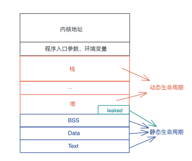

# lifecycle

## 静态生命周期 和 动态生命周期


*静态生命周期*：一个值的生命周期贯穿整个进程的生命周期.

当值拥有静态生命周期，其引用也具有静态生命周期。我们在表述这种引用的时候，可以用 'static 来表示。比如： &'static str
代表这是一个具有静态生命周期的字符串引用

全局变量、静态变量、字符串字面量（string literal）等，都拥有静态生命周期。使用了 Box::leak的堆内存，也具有静态生命周期。

*动态生命周期*：一个值是在某个作用域中定义的，也就是说它被创建在栈上或者堆上。

对于动态生命周期，我们约定用 'a 、'b 或者 'hello 这样的小写字符或者字符串来表述。 ' 后面具体是什么名字不重要，它代表某一段动态的生命周期.

分配在堆和栈上的内存有其各自的作用域，它们的生命周期是动态的。

全局变量、静态变量、字符串字面量、代码等内容，在编译时，会被编译到可执行文件中的 BSS/Data/RoData/Text
段，然后在加载时，装入内存。因而，它们的生命周期和进程的生命周期一致，所以是静态的。
函数指针的生命周期也是静态的，因为函数在 Text 段中，只要进程活着，其内存一直存在。

## 生命周期标注（lifetime specifier）

生命周期标注的目的是，在参数和返回值之间建立联系或者约束。调用函数时，传入的参数的生命周期需要大于等于（outlive）标注的生命周期。

修改前代码

```rust
fn get_max(s1: &str) -> &str {
    max(s1, "Chandler")
}

fn max(s1: &str, s2: &str) -> &str {
    if s1 > s2 {
        s1
    } else {
        s2
    }
}
```

报错：error[E0106]: missing lifetime specifier。字符串字面量的生命周期是静态的，而 s1 是动态的，它们的生命周期显然不一致。
当出现了多个参数，它们的生命周期可能不一致时，返回值的生命周期就不好确定了。编译器在编译某个函数时，并不知道这个函数将来有谁调用、怎么调用，所以，函数本身携带的信息，就是编译器在编译时使用的全部信息。

修改后代码

```rust
fn get_max(s1: &str) -> &str {
    max(s1, "Danny")
}

fn max<'a>(s1: &'a str, s2: &'a str) -> &'a str {
    if s1 > s2 {
        s1
    } else {
        s2
    }
}
```

s1 和 s2 的生命周期只要大于等于（outlive） 'a，就符合参数的约束，而返回值的生命周期同理，也需要大于等于 'a 。
“Danny” 是静态生命周期，它大于 s1 的生命周期'a ，所以它也可以满足 max() 的约束需求。

自动添加标注：

1. 所有引用类型的参数都有独立的生命周期 'a 、'b 等。
2. 如果只有一个引用型输入，它的生命周期会赋给所有输出。
3. 如果有多个引用类型的参数，其中一个是 self，那么它的生命周期会赋给所有输出。

规则 一二

```rust
fn main() {
    let s1 = "Hello world";

    println!("first word of s1: {}", first(&s1));
}

fn first(s: &str) -> &str {
    let trimmed = s.trim();
    match trimmed.find(' ') {
        None => "",
        Some(pos) => &trimmed[..pos],
    }
}
```

相当于

```rust
fn first<'a>(s: &'a str) -> &'a str {
    let trimmed = s.trim();
    match trimmed.find(' ') {
        None => "",
        Some(pos) => &trimmed[..pos],
    }
}
```

规则三：max 无法判断，'a 还是'b 呢？这里的冲突，编译器无能为力

```rust
fn max<'a, 'b>(s1: &'a str, s2: &'b str) -> &' ? ? ? str
```


返回值和谁的生命周期有关？是指向字符串引用的可变引用 &mut ，还是字符串引用 &str 本身.显然是后者

```rust
pub fn strtok<'b, 'a>(s: &'b mut &'a str, delimiter: char) -> &'a str { ... }
```

简化

```rust
pub fn strtok<'a>(s: &mut &'a str, delimiter: char) -> &'a str { ... }
```
