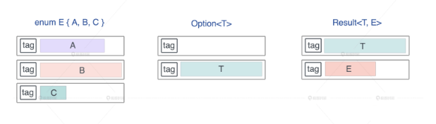
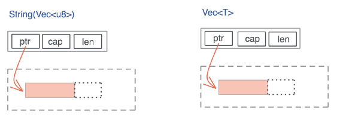
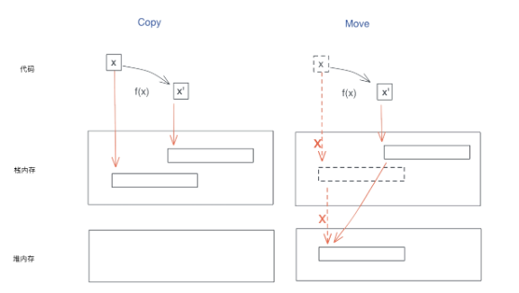

<!-- START doctoc generated TOC please keep comment here to allow auto update -->
<!-- DON'T EDIT THIS SECTION, INSTEAD RE-RUN doctoc TO UPDATE -->
**Table of Contents**  *generated with [DocToc](https://github.com/thlorenz/doctoc)*

- [memory](#memory)
  - [enum、Option 以及 Result 的布局](#enumoption-%E4%BB%A5%E5%8F%8A-result-%E7%9A%84%E5%B8%83%E5%B1%80)
  - [vec<T> 和 String](#vect-%E5%92%8C-string)
  - [move and copy 内存模型](#move-and-copy-%E5%86%85%E5%AD%98%E6%A8%A1%E5%9E%8B)
  - [drop 释放资源](#drop-%E9%87%8A%E6%94%BE%E8%B5%84%E6%BA%90)
    - [Drop 使用场景](#drop-%E4%BD%BF%E7%94%A8%E5%9C%BA%E6%99%AF)
    - [Drop 的顺序](#drop-%E7%9A%84%E9%A1%BA%E5%BA%8F)

<!-- END doctoc generated TOC please keep comment here to allow auto update -->

# memory

## enum、Option 以及 Result 的布局



```shell
Type                        T    Option<T>    Result<T, io::Error>
----------------------------------------------------------------
u8                          1        2           16
f64                         8       16           16
&u8                         8        8           16
Box<u8>                     8        8           16
&[u8]                      16       16           16
String                     24       24           24
Vec<u8>                    24       24           24
HashMap<String, String>    48       48           48
E                          56       56           56

```

Option 配合带有引用类型的数据结构，比如 &u8、Box、Vec、HashMap ，没有额外占用空间.

对于 Option 结构而言，它的 tag 只有两种情况：0 或 1， tag 为 0 时，表示 None，tag 为 1 时，表示 Some。

## vec<T> 和 String


String 结构的源码，可以看到，它内部就是一个 Vec.

```rust
#[derive(PartialEq, PartialOrd, Eq, Ord)]
#[stable(feature = "rust1", since = "1.0.0")]
#[cfg_attr(not(test), lang = "String")]
pub struct String {
    vec: Vec<u8>,
}
```

Vec 结构是 3 个 word 的胖指针，包含：一个指向堆内存的指针 pointer、分配的堆内存的容量 capacity，以及数据在堆内存的长度
length

## move and copy 内存模型



其实 Copy 和 Move 在内部实现上，都是浅层的按位做内存复制，只不过 Copy 允许你访问之前的变量，而 Move 不允许.

如果你要复制的只是原生类型（Copy）或者栈上的胖指针（Move），不涉及堆内存的复制也就是深拷贝（deep
copy），那这个效率是非常高的，我们不必担心每次赋值或者每次传参带来的性能损失。

所以，无论是 Copy 还是 Move，它的效率都是非常高的.

## drop 释放资源

### Drop 使用场景

对于 Drop 而言，主要有两个功能：

- 回收内存资源
- 执行一些收尾工作

### Drop 的顺序

- 变量级别，按照逆序的方式，_x 在 _foo 之前创建，因此 _x 在 _foo 之后被 drop
- 结构体内部，按照顺序的方式，结构体 _x 中的字段按照定义中的顺序依次 drop


