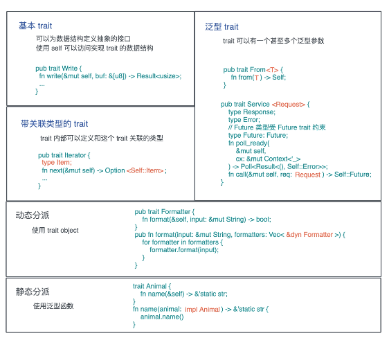
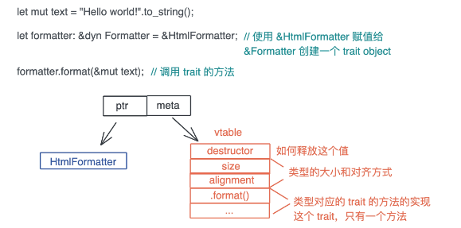

<!-- START doctoc generated TOC please keep comment here to allow auto update -->
<!-- DON'T EDIT THIS SECTION, INSTEAD RE-RUN doctoc TO UPDATE -->
**Table of Contents**  *generated with [DocToc](https://github.com/thlorenz/doctoc)*

- [多态实现](#%E5%A4%9A%E6%80%81%E5%AE%9E%E7%8E%B0)
- [unit()](#unit)
- [用泛型实现 参数多态](#%E7%94%A8%E6%B3%9B%E5%9E%8B%E5%AE%9E%E7%8E%B0-%E5%8F%82%E6%95%B0%E5%A4%9A%E6%80%81)
  - [泛型函数](#%E6%B3%9B%E5%9E%8B%E5%87%BD%E6%95%B0)
- [trait 实现特设多态](#trait-%E5%AE%9E%E7%8E%B0%E7%89%B9%E8%AE%BE%E5%A4%9A%E6%80%81)
  - [带关联类型的 trait](#%E5%B8%A6%E5%85%B3%E8%81%94%E7%B1%BB%E5%9E%8B%E7%9A%84-trait)
- [子类型多态](#%E5%AD%90%E7%B1%BB%E5%9E%8B%E5%A4%9A%E6%80%81)
  - [Trait Object](#trait-object)
- [类型转换](#%E7%B1%BB%E5%9E%8B%E8%BD%AC%E6%8D%A2)

<!-- END doctoc generated TOC please keep comment here to allow auto update -->

## 多态实现

动态类型系统，多态通过鸭子类型（duck typing）实现

静态类型系统，多态可以通过参数多态（parametric polymorphism）、特设多态（adhoc polymorphism）和子类型多态（subtype
polymorphism）实现。

- 参数多态是指，代码操作的类型是一个满足某些约束的参数，而非具体的类型。
- 特设多态是指同一种行为有多个不同实现的多态。比如加法，可以 1+1，也可以是 “abc” + “cde”、matrix1 + matrix2、甚至 matrix1 +
  vector1。在面向对象编程语言中，特设多态一般指函数的重载。
- 子类型多态是指，在运行时，子类型可以被当成父类型使用。

在 Rust 中，参数多态通过泛型来支持、特设多态通过 trait 来支持、子类型多态可以用 trait object 来支持，

## unit()

unit 是只有一个值的类型，它的值和类型都是 ()

if 块，它的类型和返回值是()

```rust
fn work(has_work: bool) {
    if has_work {
        do_something();
    }
}
```

## 用泛型实现 参数多态

函数，是把重复代码中的参数抽取出来，使其更加通用，调用函数的时候，根据参数的不同，我们得到不同的结果；

而泛型，是把重复数据结构中的参数抽取出来，在使用泛型类型时，根据不同的参数，我们会得到不同的具体类型。

一种类似函数参数的类型声明，用 “:” 来表明约束，多个约束之间用 + 来表示；
另一种是使用 where 子句，在定义的结尾来表明参数的约束。两种方法都可以，且可以共存

```rust
#[stable(feature = "rust1", since = "1.0.0")]
#[cfg_attr(not(test), rustc_diagnostic_item = "Cow")]
pub enum Cow<'a, B: ?Sized + 'a>
where
    B: ToOwned,
{
    /// Borrowed data.
    #[stable(feature = "rust1", since = "1.0.0")]
    Borrowed(#[stable(feature = "rust1", since = "1.0.0")] &'a B),

    /// Owned data.
    #[stable(feature = "rust1", since = "1.0.0")]
    Owned(#[stable(feature = "rust1", since = "1.0.0")] <B as ToOwned>::Owned),
}

```

B 的三个约束分别是：

- 生命周期 'a
- 长度可变 ?Sized
- 符合 ToOwned trait

### 泛型函数

对于泛型函数，Rust 会进行单态化（Monomorphization）处理，也就是在编译时，把所有用到的泛型函数的泛型参数展开，生成若干个函数

## trait 实现特设多态



trait 是 Rust 中的接口，它定义了类型使用这个接口的行为。

```rust
#[stable(feature = "rust1", since = "1.0.0")]
#[doc(notable_trait)]
#[cfg_attr(not(test), rustc_diagnostic_item = "IoWrite")]
pub trait Write {
    #[stable(feature = "rust1", since = "1.0.0")]
    fn write(&mut self, buf: &[u8]) -> Result<usize>;

    #[stable(feature = "iovec", since = "1.36.0")]
    fn write_vectored(&mut self, bufs: &[IoSlice<'_>]) -> Result<usize> {
        default_write_vectored(|b| self.write(b), bufs)
    }

    #[unstable(feature = "can_vector", issue = "69941")]
    fn is_write_vectored(&self) -> bool {
        false
    }

    #[stable(feature = "rust1", since = "1.0.0")]
    fn flush(&mut self) -> Result<()>;


    #[stable(feature = "rust1", since = "1.0.0")]
    fn write_all(&mut self, mut buf: &[u8]) -> Result<()> {
        while !buf.is_empty() {
            match self.write(buf) {
                Ok(0) => {
                    return Err(error::const_io_error!(
                        ErrorKind::WriteZero,
                        "failed to write whole buffer",
                    ));
                }
                Ok(n) => buf = &buf[n..],
                Err(ref e) if e.is_interrupted() => {}
                Err(e) => return Err(e),
            }
        }
        Ok(())
    }


    #[unstable(feature = "write_all_vectored", issue = "70436")]
    fn write_all_vectored(&mut self, mut bufs: &mut [IoSlice<'_>]) -> Result<()> {
        // Guarantee that bufs is empty if it contains no data,
        // to avoid calling write_vectored if there is no data to be written.
        IoSlice::advance_slices(&mut bufs, 0);
        while !bufs.is_empty() {
            match self.write_vectored(bufs) {
                Ok(0) => {
                    return Err(error::const_io_error!(
                        ErrorKind::WriteZero,
                        "failed to write whole buffer",
                    ));
                }
                Ok(n) => IoSlice::advance_slices(&mut bufs, n),
                Err(ref e) if e.is_interrupted() => {}
                Err(e) => return Err(e),
            }
        }
        Ok(())
    }

    #[stable(feature = "rust1", since = "1.0.0")]
    fn write_fmt(&mut self, fmt: fmt::Arguments<'_>) -> Result<()> {
        // Create a shim which translates a Write to a fmt::Write and saves
        // off I/O errors. instead of discarding them
        struct Adapter<'a, T: ?Sized + 'a> {
            inner: &'a mut T,
            error: Result<()>,
        }

        impl<T: Write + ?Sized> fmt::Write for Adapter<'_, T> {
            fn write_str(&mut self, s: &str) -> fmt::Result {
                match self.inner.write_all(s.as_bytes()) {
                    Ok(()) => Ok(()),
                    Err(e) => {
                        self.error = Err(e);
                        Err(fmt::Error)
                    }
                }
            }
        }

        let mut output = Adapter { inner: self, error: Ok(()) };
        match fmt::write(&mut output, fmt) {
            Ok(()) => Ok(()),
            Err(..) => {
                // check if the error came from the underlying `Write` or not
                if output.error.is_err() {
                    output.error
                } else {
                    Err(error::const_io_error!(ErrorKind::Uncategorized, "formatter error"))
                }
            }
        }
    }


    #[stable(feature = "rust1", since = "1.0.0")]
    fn by_ref(&mut self) -> &mut Self
    where
        Self: Sized,
    {
        self
    }
}
```

这些方法也被称作关联函数（associate function）。在 trait 中，方法可以有缺省的实现，对于这个 Write trait，你只需要实现 write 和
flush 两个方法.

两个特殊的关键字：Self 和 self。

- Self 代表当前的类型，比如 File 类型实现了 Write，那么实现过程中使用到的 Self 就指代 File。
- self 在用作方法的第一个参数时，实际上是 self: Self 的简写，所以 &self 是 self: &Self, 而 &mut self 是 self: &mut Self

### 带关联类型的 trait

不同的实现者可以使用不同的错误类型

```rust
pub trait Parse {
    type Error;
    fn parse(s: &str) -> Result<Self, Self::Error>;
}
```

允许用户把错误类型延迟到 trait 实现时才决定，这种带有关联类型的 trait 比普通 trait，更加灵活，抽象度更高.

trait 方法里的参数或者返回值，都可以用关联类型来表述，而在实现有关联类型的 trait 时，只需要额外提供关联类型的具体类型即可

## 子类型多态

```rust
// 泛型函数
fn name(animal: impl Animal) -> &'static str {
    animal.name()
}
trait Animal {
    fn name(&self) -> &'static str;
}

```

### Trait Object

```rust
pub fn format(input: &mut String, formatters: Vec<&dyn Formatter>) {
    for formatter in formatters {
        formatter.format(input);
    }
}
```

正常情况下，Vec<> 容器里的类型需要是一致的，但此处无法给定一个一致的类型。
所以我们要有一种手段，告诉编译器，此处需要并且仅需要任何实现了 Formatter 接口的数据类型。在 Rust 里，这种类型叫 Trait
Object，表现为 &dyn Trait 或者 Box。

dyn 关键字只是用来帮助我们更好地区分普通类型和 Trait 类型.



HtmlFormatter 的引用赋值给 Formatter 后，会生成一个 Trait Object，在上图中可以看到，Trait Object
的底层逻辑就是胖指针。其中，一个指针指向数据本身，另一个则指向虚函数表（vtable）.

vtable 是一张静态的表，Rust 在编译时会为使用了 trait object 的类型的 trait 实现生成一张表，放在可执行文件中（一般在 TEXT 或
RODATA 段）。

## 类型转换

- AsRef: 当需要通用函数支持不同类型时，AsRef 可以将它们转换为共通的引用形式。
- Deref: 主要用于实现解引用运算符（*）的重载，允许自定义类型被当作引用处理。

AsRef用于将值转换成引用形式，特别适用于泛型编程；Deref则允许自定义类型表现得如同引用一样，主要用于智能指针等类型；