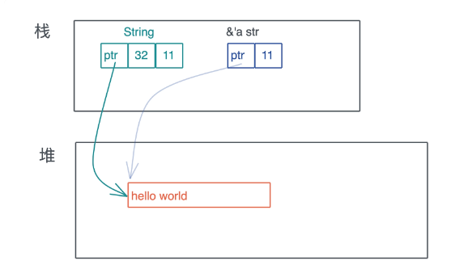

<!-- START doctoc generated TOC please keep comment here to allow auto update -->
<!-- DON'T EDIT THIS SECTION, INSTEAD RE-RUN doctoc TO UPDATE -->
**Table of Contents**  *generated with [DocToc](https://github.com/thlorenz/doctoc)*

- [智能指针](#%E6%99%BA%E8%83%BD%E6%8C%87%E9%92%88)
  - [COW 写时克隆(Clone on write)的智能指针](#cow-%E5%86%99%E6%97%B6%E5%85%8B%E9%9A%86clone-on-write%E7%9A%84%E6%99%BA%E8%83%BD%E6%8C%87%E9%92%88)
    - [Cow的使用场景](#cow%E7%9A%84%E4%BD%BF%E7%94%A8%E5%9C%BA%E6%99%AF)
  - [MutexGuard](#mutexguard)

<!-- END doctoc generated TOC please keep comment here to allow auto update -->

## 智能指针

在 Rust 中，凡是需要做资源回收的数据结构，且实现了 Deref/DerefMut/Drop，都是智能指针。

智能指针是一个表现行为很像指针的数据结构，但除了指向数据的指针外，它还有元数据以提供额外的处理能力。

String 对堆上的值有所有权，而 &str 是没有所有权的，这是 Rust 中智能指针和普通胖指针的区别。
智能指针一定是一个胖指针，但胖指针不一定是一个智能指针。比如 &str 就只是一个胖指针，它有指向堆内存字符串的指针，同时还有关于字符串长度的元数据。



### COW 写时克隆(Clone on write)的智能指针

```rust
#[stable(feature = "rust1", since = "1.0.0")]
#[cfg_attr(not(test), rustc_diagnostic_item = "Cow")]
pub enum Cow<'a, B: ?Sized + 'a>
where
    B: ToOwned,
{
    /// Borrowed data.
    #[stable(feature = "rust1", since = "1.0.0")]
    Borrowed(#[stable(feature = "rust1", since = "1.0.0")] &'a B),

    /// Owned data.
    #[stable(feature = "rust1", since = "1.0.0")]
    Owned(#[stable(feature = "rust1", since = "1.0.0")] <B as ToOwned>::Owned),
}
```

是一个enum，包含一个对类型B的只读引用，或者包含一个拥有类型B的所有权的数据。 使用Cow使我们在返回数据时提供了两种可能:
要么返回一个借用的数据(只读)，要么返回一个拥有所有权的数据(可读写)。

ToOwned 解释

```rust
#[cfg_attr(not(test), rustc_diagnostic_item = "ToOwned")]
#[stable(feature = "rust1", since = "1.0.0")]
pub trait ToOwned {
    /// The resulting type after obtaining ownership.
    #[stable(feature = "rust1", since = "1.0.0")]
    type Owned: Borrow<Self>;


    #[stable(feature = "rust1", since = "1.0.0")]
    #[must_use = "cloning is often expensive and is not expected to have side effects"]
    #[cfg_attr(not(test), rustc_diagnostic_item = "to_owned_method")]
    fn to_owned(&self) -> Self::Owned;

    #[stable(feature = "toowned_clone_into", since = "1.63.0")]
    fn clone_into(&self, target: &mut Self::Owned) {
        *target = self.to_owned();
    }
}
```

str 对 ToOwned trait 的实现

```rust
impl ToOwned for str {
    type Owned = String;
    #[inline]
    fn to_owned(&self) -> String {
        unsafe { String::from_utf8_unchecked(self.as_bytes().to_owned()) }
    }

    fn clone_into(&self, target: &mut String) {
        let mut b = mem::take(target).into_bytes();
        self.as_bytes().clone_into(&mut b);
        *target = unsafe { String::from_utf8_unchecked(b) }
    }
}
```

String 要实现 Borrow

```rust
impl Borrow<str> for String {
    #[inline]
    fn borrow(&self) -> &str {
        &self[..]
    }
}
```

#### Cow的使用场景

使用Cow主要用来减少内存的分配和复制，因为绝大多数的场景都是读多写少。使用Cow可以在需要些的时候才做一次内存复制，这样就很大程度减少了内存复制次数

```rust
use std::borrow::Cow;

const SENSITIVE_WORD: &str = "bad";

fn remove_sensitive_word<'a>(words: &'a str) -> Cow<'a, str> {
    if words.contains(SENSITIVE_WORD) {
        Cow::Owned(words.replace(SENSITIVE_WORD, ""))
    } else {
        Cow::Borrowed(words)
    }
}

fn remove_sensitive_word_old(words: &str) -> String {
    if words.contains(SENSITIVE_WORD) {
        words.replace(SENSITIVE_WORD, "")
    } else {
        words.to_owned()
    }
}

fn main() {
    let words = "I'm a bad boy.";
    let new_words = remove_sensitive_word(words);
    println!("{}", new_words);

    let new_words = remove_sensitive_word_old(words);
    println!("{}", new_words);
}
```

remove_sensitive_word和remove_sensitive_word_old两种实现，前者的返回值使用了Cow，后者返回值使用的是String。
仔细分析一下，很明显前者的实现效率更高。
因为如果输入的字符串中没有敏感词时，前者Cow::Borrowed(words)不会发生堆内存的分配和拷贝，后者words.to_owned()
会发生一次堆内存的分配和拷贝。

### MutexGuard

不但通过 Deref 提供良好的用户体验，还通过 Drop trait 来确保，使用到的内存以外的资源在退出时进行释放。
