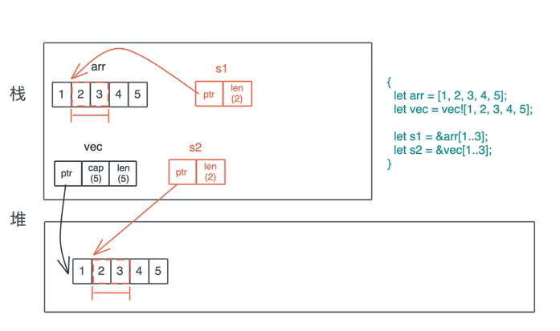
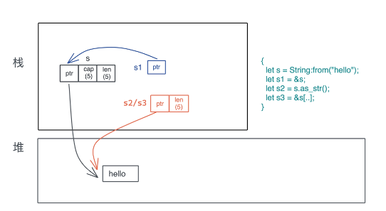
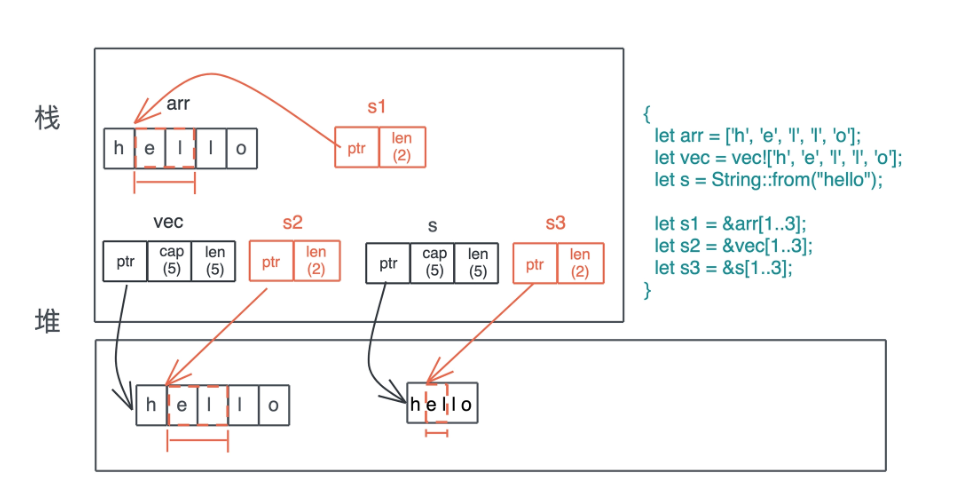
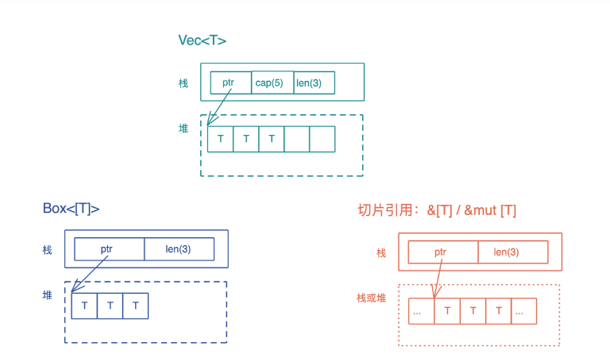
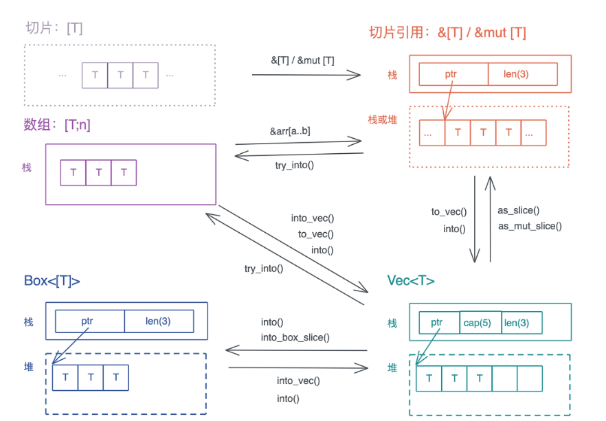

<!-- START doctoc generated TOC please keep comment here to allow auto update -->
<!-- DON'T EDIT THIS SECTION, INSTEAD RE-RUN doctoc TO UPDATE -->
**Table of Contents**  *generated with [DocToc](https://github.com/thlorenz/doctoc)*

- [集合容器](#%E9%9B%86%E5%90%88%E5%AE%B9%E5%99%A8)
  - [切片](#%E5%88%87%E7%89%87)
    - [特殊的切片：&str](#%E7%89%B9%E6%AE%8A%E7%9A%84%E5%88%87%E7%89%87str)
    - [切片的引用 &[T] 和堆上的切片Box<[T]>](#%E5%88%87%E7%89%87%E7%9A%84%E5%BC%95%E7%94%A8-t-%E5%92%8C%E5%A0%86%E4%B8%8A%E7%9A%84%E5%88%87%E7%89%87boxt)

<!-- END doctoc generated TOC please keep comment here to allow auto update -->

# 集合容器

集合容器，是把一系列拥有相同类型的数据放在一起，统一处理

- 字符串 String、数组 [T; n]、列表 Vec 和哈希表 HashMap 等；
- 切片 slice
- 循环缓冲区 VecDeque、双向列表 LinkedList 等

## 切片

切片是描述一组属于同一类型、长度不确定的、在内存中连续存放的数据结构，用 [T] 来表述。因为长度不确定，所以切片是个
DST（Dynamically Sized Type）。

* &[T]：表示一个只读的切片引用。
* &mut [T]：表示一个可写的切片引用。
* Box<[T]>：一个在堆上分配的切片。

### 特殊的切片：&str

String、&String、&str

- String 在解引用时，会转换成 &str

数组[T; n] 、列表 vec、字符串 String 以及它们的切片关系

### 切片的引用 &[T] 和堆上的切片Box<[T]>

Box<[T]> 和切片的引用 &[T] 也很类似：它们都是在栈上有一个包含长度的胖指针，指向存储数据的内存位置。区别是：Box<[T]>
只会指向堆，&[T] 指向的位置可以是栈也可以是堆；此外，Box<[T]> 对数据具有所有权，而 &[T] 只是一个借用。

