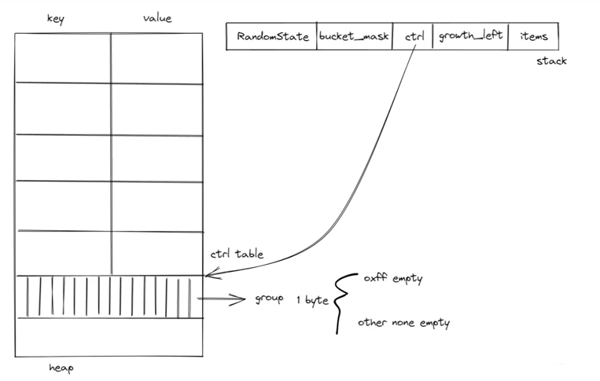
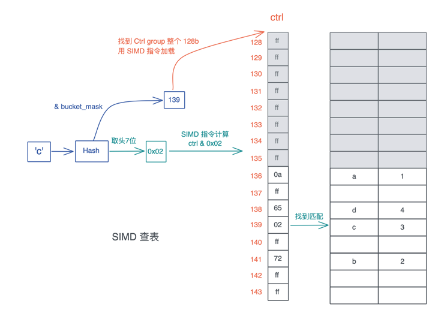

<!-- START doctoc generated TOC please keep comment here to allow auto update -->
<!-- DON'T EDIT THIS SECTION, INSTEAD RE-RUN doctoc TO UPDATE -->
**Table of Contents**  *generated with [DocToc](https://github.com/thlorenz/doctoc)*

- [hash](#hash)
  - [hashMap](#hashmap)
    - [结构](#%E7%BB%93%E6%9E%84)
    - [扩容和缩容](#%E6%89%A9%E5%AE%B9%E5%92%8C%E7%BC%A9%E5%AE%B9)
  - [HashSet](#hashset)
  - [BTreeMap](#btreemap)
  - [BTreeSet](#btreeset)
  - [参考](#%E5%8F%82%E8%80%83)

<!-- END doctoc generated TOC please keep comment here to allow auto update -->

# hash

## hashMap

Rust 中 HashMap 采用的是开放寻址法处理冲突
> A hash map implemented with quadratic probing and SIMD lookup.

- 二次探查（quadratic probing): 理论上是在冲突发生时，不断探寻哈希位置加减 n 的二次方，找到空闲的位置插入
- SIMD 查表（SIMD lookup）: SIMD 借助现代 CPU 单指令多数据集的能力，在rust 中, 通过一个指令可以将多个相关数据（16个 ctrl
  bytes）加载到内存，大大提高了查表的速度。

### 结构

```rust
// 1.82.0-c55404ec682381aef0f0325c615d2e21ffe04092/library/std/src/collections/hash/map.rs

use hashbrown::hash_map as base;
use crate::hash::{BuildHasher, Hash, RandomState};

#[cfg_attr(not(test), rustc_diagnostic_item = "HashMap")]
#[stable(feature = "rust1", since = "1.0.0")]
#[rustc_insignificant_dtor]
pub struct HashMap<K, V, S = RandomState> {
    base: base::HashMap<K, V, S>,
}

// src/hash/random.rs
#[stable(feature = "hashmap_build_hasher", since = "1.7.0")]
#[derive(Clone)]
pub struct RandomState {
    k0: u64,
    k1: u64,
}

// 1.82.0-0f03adc482c497f86e341cd37c08bc292e2190c0/vendor/hashbrown/src/map.rs
pub struct HashMap<K, V, S = DefaultHashBuilder, A: Allocator = Global> {
    pub(crate) hash_builder: S,
    pub(crate) table: RawTable<(K, V), A>,
}
```

HashMap 有三个泛型参数，K 和 V 代表 key/value 的类型，S 是哈希算法的状态，它默认是 RandomState，占两个 u64。
RandomState 使用 SipHash 作为缺省的哈希算法，它是一个加密安全的哈希函数（cryptographically secure hashing）

Rust 的 HashMap 复用了 hashbrown 的 HashMap。hashbrown 是 Rust 下对 Google Swiss Table 的一个改进版实现.

HashMap 里有两个域，一个是 hash_builder，类型是标准库使用的 RandomState，还有一个是具体的 RawTable

```rust

// 其中 T 是 (K, V)，A 是内存分配器
pub struct RawTable<T, A: Allocator = Global> {
    table: RawTableInner,
    alloc: A,
    // Tell dropck that we own instances of T.
    marker: PhantomData<T>,
}

/// Non-generic part of `RawTable` which allows functions to be instantiated only once regardless
/// of how many different key-value types are used.
struct RawTableInner {
    // 哈希表中哈希桶的数量减一
    bucket_mask: usize,

    // [Padding], T1, T2, ..., Tlast, C1, C2, ...
    //                                ^ points here
    // 指向堆内存哈希表末端的 ctrl 区的指针
    ctrl: NonNull<u8>,

    // 下次扩容前，还能插入的数量
    growth_left: usize,

    // 哈希表中元素数量
    items: usize,
}
```

ctrl 表的主要目的是快速查找.



一张 ctrl 表里，有若干个 128bit 或者说 16 个字节的分组（group），group 里的每个字节叫 ctrl byte，对应一个 bucket，那么一个
group 对应 16 个 bucket。如果一个 bucket 对应的 ctrl byte 首位不为 1，就表示这个 ctrl byte 被使用；如果所有位都是
1，或者说这个字节是 0xff，那么它是空闲的.

现在要查找 key 为 ‘c’ 的数据：


1. 首先对 ‘c’ 做哈希，得到一个哈希值 h；
2. 把 h 跟 bucket_mask 做与，得到一个值，图中是 139；
3. 拿着这个 139，找到对应的 ctrl group 的起始位置，因为 ctrl group 以 16 为一组，所以这里找到 128；
4. 用 SIMD 指令加载从 128 对应地址开始的 16 个字节；
5. 对 hash 取头 7 个 bit，然后和刚刚取出的 16 个字节一起做与，找到对应的匹配，如果找到了，它（们）很大概率是要找的值；
6. 如果不是，那么以二次探查（以 16 的倍数不断累积）的方式往后查找，直到找到为止。

### 扩容和缩容

当 HashMap::new() 时，它并没有分配空间，容量为零，随着哈希表不断插入数据，它会以 2 的幂减一的方式增长，最小是3。

以 2 的 n 次幂的方式进行扩容，0，3 (22 - 1)，7 (23 - 1)，14 (24 - 24 * 12.5%)，28 (25 - 25 * 12.5%)

```rust
pub struct HashMap<K, V, S = RandomState> {
    base: base::HashMap<K, V, S>,
}

impl<K, V, S> HashMap<K, V, S>
where
    K: Eq + Hash,
    S: BuildHasher,
{
    pub fn insert(&mut self, k: K, v: V) -> Option<V> {
        self.base.insert(k, v)
    }
}
```

```rust
impl<K, V, S, A> HashMap<K, V, S, A>
where
    K: Eq + Hash,
    S: BuildHasher,
    A: Allocator,
{
    pub fn insert(&mut self, k: K, v: V) -> Option<V> {
        // 哈希，得到一个哈希值 hash
        let hash = make_hash::<K, S>(&self.hash_builder, &k);
        let hasher = make_hasher::<_, V, S>(&self.hash_builder);
        match self
            .table
            .find_or_find_insert_slot(hash, equivalent_key(&k), hasher)
        {
            Ok(bucket) => Some(mem::replace(unsafe { &mut bucket.as_mut().1 }, v)),
            Err(slot) => {
                unsafe {
                    self.table.insert_in_slot(hash, slot, (k, v));
                }
                None
            }
        }
    }
}
```

当删除表中的数据时，原有的表大小不变，只有显式地调用 shrink_to_fit，才会让哈希表变小。

## HashSet

HashSet 是 HashMap 的简化版本，底层实现是 HashMap<K, ()>。

```rust
pub struct HashSet<T, S = DefaultHashBuilder, A: Allocator = Global> {
    pub(crate) map: HashMap<T, (), S, A>,
}

```

## BTreeMap

BTreeMap 是在 HashMap 的基础上，增加了有序性，它会按照 key 的升序来存储、便利内部元素。

```rust
#[stable(feature = "rust1", since = "1.0.0")]
#[cfg_attr(not(test), rustc_diagnostic_item = "BTreeMap")]
#[rustc_insignificant_dtor]
pub struct BTreeMap<
    K,
    V,
    #[unstable(feature = "allocator_api", issue = "32838")] A: Allocator + Clone = Global,
> {
    root: Option<Root<K, V>>,
    length: usize,
    /// `ManuallyDrop` to control drop order (needs to be dropped after all the nodes).
    pub(super) alloc: ManuallyDrop<A>,
    // For dropck; the `Box` avoids making the `Unpin` impl more strict than before
    _marker: PhantomData<crate::boxed::Box<(K, V), A>>,
}

```

## BTreeSet

BTreeSet 是 BTreeMap 的简化版本，可用来表示有序集合。

## 参考

- [rust 哈希表](https://juejin.cn/post/7134717280214056990)