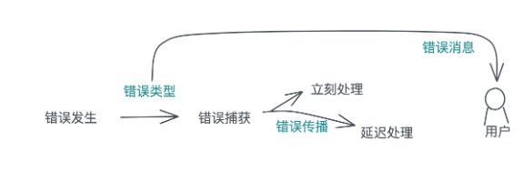
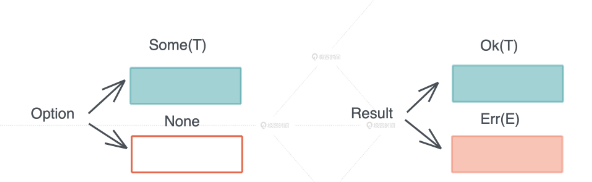

<!-- START doctoc generated TOC please keep comment here to allow auto update -->
<!-- DON'T EDIT THIS SECTION, INSTEAD RE-RUN doctoc TO UPDATE -->
**Table of Contents**  *generated with [DocToc](https://github.com/thlorenz/doctoc)*

- [error](#error)
  - [? 操作符](#-%E6%93%8D%E4%BD%9C%E7%AC%A6)
  - [Error trait 和错误类型的转换](#error-trait-%E5%92%8C%E9%94%99%E8%AF%AF%E7%B1%BB%E5%9E%8B%E7%9A%84%E8%BD%AC%E6%8D%A2)
  - [result 程序返回值](#result-%E7%A8%8B%E5%BA%8F%E8%BF%94%E5%9B%9E%E5%80%BC)
  - [Error常见开源库](#error%E5%B8%B8%E8%A7%81%E5%BC%80%E6%BA%90%E5%BA%93)
    - [thiserror](#thiserror)
    - [anyhow](#anyhow)
- [参考](#%E5%8F%82%E8%80%83)

<!-- END doctoc generated TOC please keep comment here to allow auto update -->

# error



Rust 偷师 Haskell，构建了对标 Maybe 的 Option 类型和 对标 Either 的 Result 类型。



## ? 操作符

早期 Rust 提供了 try! 宏来简化错误的显式处理，后来为了进一步提升用户体验，try! 被进化成 ? 操作符

如果你只想传播错误，不想就地处理，可以用 ? 操作符.

假设我们有个场景：

- 读取一文件
- 将文件内容转化为UTF8格式
- 将转换后格式内容转为u32的数字

```rust
fn main() {
    let path = "./dat";
    match read_file(path) {
        Ok(v) => {
            match to_utf8(v.as_bytes()) {
                Ok(u) => {
                    match to_u32(u) {
                        Ok(t) => {
                            println!("num:{:?}", t);
                        }
                        Err(e) => {
                            println!("{} {}", path, e)
                        }
                    }
                }
                Err(e) => {
                    println!("{} {}", path, e)
                }
            }
        }
        Err(e) => {
            println!("{} {}", path, e)
        }
    }
}

///读取文件内容
fn read_file(path: &str) -> Result<String, std::io::Error> {
    std::fs::read_to_string(path)
}

/// 转换为utf8内容
fn to_utf8(v: &[u8]) -> Result<&str, std::str::Utf8Error> {
    std::str::from_utf8(v)
}

/// 转化为u32数字
fn to_u32(v: &str) -> Result<u32, std::num::ParseIntError> {
    v.parse::<u32>()
}
```

问题: 代码犹如叠罗汉，程序结构越来越深

```rust
use std::io::Error as IoError;
use std::str::Utf8Error;
use std::num::ParseIntError;
use std::fmt::{Display, Formatter};


fn main() -> std::result::Result<(), CustomError> {
    let path = "./dat";
    let v = read_file(path)?;
    let x = to_utf8(v.as_bytes())?;
    let u = to_u32(x)?;
    println!("num:{:?}", u);
    Ok(())
}

///读取文件内容
fn read_file(path: &str) -> std::result::Result<String, std::io::Error> {
    std::fs::read_to_string(path)
}

/// 转换为utf8内容
fn to_utf8(v: &[u8]) -> std::result::Result<&str, std::str::Utf8Error> {
    std::str::from_utf8(v)
}

/// 转化为u32数字
fn to_u32(v: &str) -> std::result::Result<u32, std::num::ParseIntError> {
    v.parse::<u32>()
}


#[derive(Debug)]
enum CustomError {
    ParseIntError(std::num::ParseIntError),
    Utf8Error(std::str::Utf8Error),
    IoError(std::io::Error),
}
impl std::error::Error for CustomError {
    fn source(&self) -> Option<&(dyn std::error::Error + 'static)> {
        match &self {
            CustomError::IoError(ref e) => Some(e),
            CustomError::Utf8Error(ref e) => Some(e),
            CustomError::ParseIntError(ref e) => Some(e),
        }
    }
}

impl Display for CustomError {
    fn fmt(&self, f: &mut Formatter<'_>) -> std::fmt::Result {
        match &self {
            CustomError::IoError(ref e) => e.fmt(f),
            CustomError::Utf8Error(ref e) => e.fmt(f),
            CustomError::ParseIntError(ref e) => e.fmt(f),
        }
    }
}

impl From<ParseIntError> for CustomError {
    fn from(s: std::num::ParseIntError) -> Self {
        CustomError::ParseIntError(s)
    }
}

impl From<IoError> for CustomError {
    fn from(s: std::io::Error) -> Self {
        CustomError::IoError(s)
    }
}

impl From<Utf8Error> for CustomError {
    fn from(s: std::str::Utf8Error) -> Self {
        CustomError::Utf8Error(s)
    }
}
```

我们使用了?来替代原来的match匹配的方式。?使用问号作用在函数的结束，意思是：

- 程序接受了一个Result<(),CustomError>自定义的错误类型。
- 当前如果函数结果错误，程序自动抛出Err自身错误类型，并包含相关自己类型错误信息，因为我们做了From转换的操作，该函数的自身类型错误会通过实现的From操作自动转化为CustomError的自定义类型错误。
- 当前如果函数结果正确，继续之后逻辑，直到程序结束

## Error trait 和错误类型的转换

接口

```rust
// intellij-rust/stdlib-local-copy/1.78.0-ba6645f9113d6a36b36e041b03064c99e1ae9e85/library/core/src/error.rs
pub trait Error: Debug + Display {
    #[stable(feature = "error_source", since = "1.30.0")]
    fn source(&self) -> Option<&(dyn Error + 'static)> {
        None
    }

    /// Gets the `TypeId` of `self`.
    #[doc(hidden)]
    #[unstable(
        feature = "error_type_id",
        reason = "this is memory-unsafe to override in user code",
        issue = "60784"
    )]
    fn type_id(&self, _: private::Internal) -> TypeId
    where
        Self: 'static,
    {
        TypeId::of::<Self>()
    }

    // 推荐实现impl Display 
    #[stable(feature = "rust1", since = "1.0.0")]
    #[deprecated(since = "1.42.0", note = "use the Display impl or to_string()")]
    fn description(&self) -> &str {
        "description() is deprecated; use Display"
    }

    // 在1.33.0被抛弃，取而代之使用source()方法
    #[stable(feature = "rust1", since = "1.0.0")]
    #[deprecated(
        since = "1.33.0",
        note = "replaced by Error::source, which can support downcasting"
    )]
    #[allow(missing_docs)]
    fn cause(&self) -> Option<&dyn Error> {
        self.source()
    }

    /// ```
    #[unstable(feature = "error_generic_member_access", issue = "99301")]
    #[allow(unused_variables)]
    fn provide<'a>(&'a self, request: &mut Request<'a>) {}
}
```

标准库

```rust
// src/io/error.rs

#[stable(feature = "rust1", since = "1.0.0")]
pub struct Error {
    repr: Repr,
}

#[stable(feature = "rust1", since = "1.0.0")]
impl fmt::Debug for Error {
    fn fmt(&self, f: &mut fmt::Formatter<'_>) -> fmt::Result {
        fmt::Debug::fmt(&self.repr, f)
    }
}

```

## result 程序返回值

```rust
#[derive(Copy, PartialEq, PartialOrd, Eq, Ord, Debug, Hash)]
#[must_use = "this `Result` may be an `Err` variant, which should be handled"]
#[rustc_diagnostic_item = "Result"]
#[stable(feature = "rust1", since = "1.0.0")]
pub enum Result<T, E> {
    /// Contains the success value
    #[lang = "Ok"]
    #[stable(feature = "rust1", since = "1.0.0")]
    Ok(#[stable(feature = "rust1", since = "1.0.0")] T),

    /// Contains the error value
    #[lang = "Err"]
    #[stable(feature = "rust1", since = "1.0.0")]
    Err(#[stable(feature = "rust1", since = "1.0.0")] E),
}
```

```rust
impl<T, E> Result<T, E> {
    // expect 转换错误信息
    #[inline]
    #[track_caller]
    #[stable(feature = "result_expect", since = "1.4.0")]
    pub fn expect(self, msg: &str) -> T
    where
        E: fmt::Debug,
    {
        match self {
            Ok(t) => t,
            Err(e) => unwrap_failed(msg, &e),
        }
    }
}
```

## Error常见开源库

### thiserror

优点:

- 为自定义错误类型, 实现了std::fmt::Display. 通过在类型定义中使用#[error("...")], 实现了错误信息的定义.
- 通过#[from]为错误类型实现From trait. 这个变体不能含有除source error以及可能的backtrace之外的字段. 如果存在backtrace字段,
  则将从From impl中捕获backtrace
- 实现对source()的覆盖

```rust
use thiserror::Error;
#[derive(Error, Debug)]
#[non_exhaustive]
pub enum DataStoreError {
    #[error("data store disconnected")]
    Disconnect(#[from] io::Error),

    #[error("the data for key `{0}` is not available")]
    Redaction(String),

    #[error("invalid header (expected {expected:?}, found {found:?})")]
    InvalidHeader {
        expected: String,
        found: String,
    },

    #[error("unknown data store error")]
    Unknown,
}
```

不使用 thiserror

```rust
use std::fmt;

#[derive(Debug)]
enum DataFetchError {
    HttpError(u16),
    Timeout,
    InvalidPayload,
}

impl fmt::Display for DataFetchError {
    fn fmt(&self, f: &mut fmt::Formatter<'_>) -> fmt::Result {
        match self {
            Self::HttpError(code) => write!(f, "HTTP error with code: {}", code),
            Self::Timeout => write!(f, "Data fetching timed out"),
            Self::InvalidPayload => write!(f, "Invalid payload received"),
        }
    }
}

impl std::error::Error for DataFetchError {}

#[derive(Debug)]
enum DatabaseError {
    ConnectionFailed,
    WriteFailed(String),
}

impl fmt::Display for DatabaseError {
    fn fmt(&self, f: &mut fmt::Formatter<'_>) -> fmt::Result {
        match self {
            Self::ConnectionFailed => write!(f, "Failed to connect to database"),
            Self::WriteFailed(reason) => write!(f, "Failed to write to database: {}", reason),
        }
    }
}

impl std::error::Error for DatabaseError {}
```

使用 thiserror

```rust
use thiserror::Error;

#[derive(Debug, Error)]
enum DataFetchError {
    #[error("HTTP error with code: {0}")]
    HttpError(u16),
    #[error("Data fetching timed out")]
    Timeout,
    #[error("Invalid payload received")]
    InvalidPayload,
}

#[derive(Debug, Error)]
enum DatabaseError {
    #[error("Failed to connect to database")]
    ConnectionFailed,
    #[error("Failed to write to database: {0}")]
    WriteFailed(String),
}

```

- 代码减少: 对于每种错误类型，我们都不再需要单独的Display和Error trait实现。这大大减少了样板代码，并提高了代码的可读性。
- 错误消息与定义在一起: 使用thiserror，我们可以直接在错误定义旁边写出错误消息。这使得代码更加组织化，方便查找和修改。
- 可维护性增加: 如果我们要添加或删除错误类型，只需要修改枚举定义并更新错误消息即可，而不需要在其他地方进行更改

### anyhow

Rust的标准库提供了Result和Option类型用于错误处理，但它们通常需要指定错误类型。与此不同，anyhow::Result允许更简单地创建和处理错误。

anyhow 的一些主要特点：

- 简化的错误创建和返回: 使用 anyhow，你可以通过 anyhow!
  宏轻松创建错误。它可以接受字符串、字符串字面量，甚至格式化的错误消息。同时，它支持 ? 运算符用于错误的传递。
- 动态错误类型: anyhow 提供的错误类型是动态的，可以封装任意的错误类型。这允许你在不需要详细错误分类或向上游库用户暴露错误类型定义时，快速构建应用程序。
- 链式错误: anyhow 支持“链式”错误，这意味着你可以将一个错误附加到另一个错误上，形成一个错误链。这在诊断错误原因上特别有用。
- 无需定义自定义错误类型: 对于许多应用场景，特别是应用程序开发，不需要定义和维护一整套自己的错误类型。与其他错误处理库（如
  thiserror）不同，anyhow 提供了无需自定义错误类型即可进行错误处理的功能。
- Backtrace 支持: anyhow 自动捕获错误发生时的回溯（如果 Rust 已经开启了回溯捕获），这对调试和错误报告至关重要。

# 参考

- [细说Rust错误处理](https://github.com/baoyachi/rust-error-handle)
