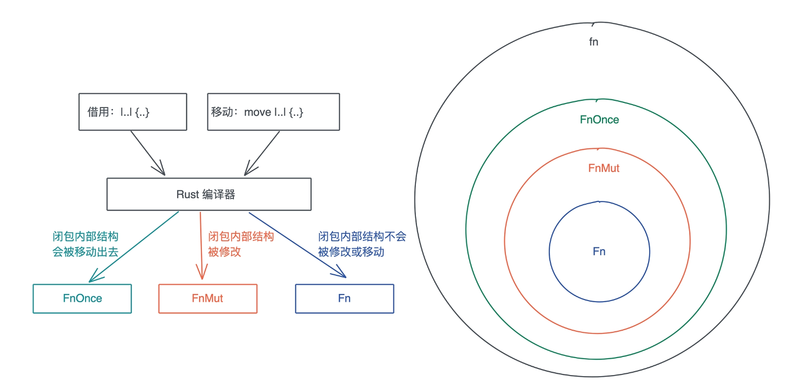

<!-- START doctoc generated TOC please keep comment here to allow auto update -->
<!-- DON'T EDIT THIS SECTION, INSTEAD RE-RUN doctoc TO UPDATE -->
**Table of Contents**  *generated with [DocToc](https://github.com/thlorenz/doctoc)*

- [闭包](#%E9%97%AD%E5%8C%85)
  - [案例](#%E6%A1%88%E4%BE%8B)
  - [Rust 的闭包类型](#rust-%E7%9A%84%E9%97%AD%E5%8C%85%E7%B1%BB%E5%9E%8B)
    - [FnOnce](#fnonce)
    - [FnMut](#fnmut)
    - [Fn](#fn)

<!-- END doctoc generated TOC please keep comment here to allow auto update -->

# 闭包

> A closure expression produces a closure value with a unique, anonymous type that cannot be written out.
> A closure type is approximately equivalent to a struct which contains the captured variables.

闭包是一种匿名类型，一旦声明，就会产生一个新的类型，但这个类型无法被其它地方使用。这个类型就像一个结构体，会包含所有捕获的变量。

## 案例

```rust
#[stable(feature = "rust1", since = "1.0.0")]
pub fn spawn<F, T>(f: F) -> JoinHandle<T>
where
    F: FnOnce() -> T,
    F: Send + 'static,
    T: Send + 'static,
{
    Builder::new().spawn(f).expect("failed to spawn thread")
}
```

- F: FnOnce() → T，表明 F 是一个接受 0 个参数、返回 T 的闭包。
- F: Send + 'static，说明闭包 F 这个数据结构，需要静态生命周期或者拥有所有权，并且它还能被发送给另一个线程。
- T: Send + 'static，说明闭包 F 返回的数据结构 T，需要静态生命周期或者拥有所有权，并且它还能被发送给另一个线程。

## Rust 的闭包类型



### FnOnce

FnOnce 只能被调用一次

```rust
#[fundamental] // so that regex can rely that `&str: !FnMut`
#[must_use = "closures are lazy and do nothing unless called"]
// FIXME(effects) #[const_trait]
pub trait FnOnce<Args: Tuple> {
    /// The returned type after the call operator is used.
    #[lang = "fn_once_output"]
    #[stable(feature = "fn_once_output", since = "1.12.0")]
    type Output;

    /// Performs the call operation.
    #[unstable(feature = "fn_traits", issue = "29625")]
    extern "rust-call" fn call_once(self, args: Args) -> Self::Output;
}
```

call_once 第一个参数是 self，它会转移 self 的所有权到 call_once 函数中

### FnMut

```rust
#[fundamental] // so that regex can rely that `&str: !FnMut`
#[must_use = "closures are lazy and do nothing unless called"]
// FIXME(effects) #[const_trait]
pub trait FnMut<Args: Tuple>: FnOnce<Args> {
    /// Performs the call operation.
    #[unstable(feature = "fn_traits", issue = "29625")]
    extern "rust-call" fn call_mut(&mut self, args: Args) -> Self::Output;
}

```

FnOnce 是 FnMut 的 super trait。所以 FnMut 也拥有 Output 这个关联类型和 call_once 这个方法。
此外，它还有一个 call_mut() 方法。注意 call_mut() 传入 &mut self，它不移动 self，所以 FnMut 可以被多次调用。

### Fn

```rust
#[fundamental] // so that regex can rely that `&str: !FnMut`
#[must_use = "closures are lazy and do nothing unless called"]
// FIXME(effects) #[const_trait]
pub trait Fn<Args: Tuple>: FnMut<Args> {
    /// Performs the call operation.
    #[unstable(feature = "fn_traits", issue = "29625")]
    extern "rust-call" fn call(&self, args: Args) -> Self::Output;
}

```

Fn “继承”了 FnMut