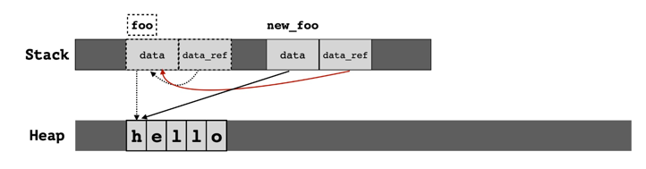

<!-- START doctoc generated TOC please keep comment here to allow auto update -->
<!-- DON'T EDIT THIS SECTION, INSTEAD RE-RUN doctoc TO UPDATE -->
**Table of Contents**  *generated with [DocToc](https://github.com/thlorenz/doctoc)*

- [future](#future)
  - [前置 trait: pin/ unpin](#%E5%89%8D%E7%BD%AE-trait-pin-unpin)
    - [pin 解决方式](#pin-%E8%A7%A3%E5%86%B3%E6%96%B9%E5%BC%8F)
  - [future 实现](#future-%E5%AE%9E%E7%8E%B0)
    - [返回值: PollSelf::Output](#%E8%BF%94%E5%9B%9E%E5%80%BC-pollselfoutput)
    - [入参 self: Pin<&mut Self>, cx: &mut Context<'_>](#%E5%85%A5%E5%8F%82-self-pinmut-self-cx-mut-context_)
      - [waker 的 vtable 第三方实现->futures-task](#waker-%E7%9A%84-vtable-%E7%AC%AC%E4%B8%89%E6%96%B9%E5%AE%9E%E7%8E%B0-futures-task)
  - [async 实现](#async-%E5%AE%9E%E7%8E%B0)
  - [stream](#stream)
    - [futures-core](#futures-core)
  - [参考](#%E5%8F%82%E8%80%83)

<!-- END doctoc generated TOC please keep comment here to allow auto update -->

# future

在异步操作里，异步处理完成后的结果，一般用 Promise 来保存，它是一个对象，用来描述在未来的某个时刻才能获得的结果的值

在很多支持异步的语言中，Promise 也叫 Future / Delay / Deferred 等。

JavaScript Promise 一般存在三个状态；

1. 初始状态，Promise 还未运行；
2. 等待（pending）状态，Promise 已运行，但还未结束；
3. 结束状态，Promise 成功解析出一个值，或者执行失败。

async 定义了一个可以并发执行的任务，而 await 则触发这个任务并发执行。大多数语言中，async/await 是一个语法糖（syntactic
sugar），它使用状态机将 Promise 包装起来，让异步调用的使用感觉和同步调用非常类似，也让代码更容易阅读。

async 来方便地生成 Future，await 来触发 Future 的调度和执行。

## 前置 trait: pin/ unpin

- pin: 将一个值标记为“被固定”表示不能移动或重新分配这个值。
- unpin: 在内存中安全地移动



```rust
struct SelfReferenceFoo {
    data: String,
    data_ref: *const String,
}


impl SelfReferenceFoo {
    fn print_data(&self) {
        println!("data: {:?}, memory address: {:p}", self.data, &self.data);
    }

    fn print_data_ref(&self) {
        println!(
            "data that referenced: {:?}, memory address: {:p}",
            unsafe { &*self.data_ref },
            self.data_ref
        );
    }
}

impl SelfReferenceFoo {
    fn new(data: String) -> Self {
        SelfReferenceFoo {
            data,
            data_ref: std::ptr::null(),
        }
    }

    // 设置 data_ref，将其指向 data
    fn set_data_ref(&mut self) {
        self.data_ref = &self.data as *const String;
    }
}

fn main() {
    let mut foo = SelfReferenceFoo::new(String::from("hello"));
    foo.set_data_ref();

    println!("[before move]");
    foo.print_data();
    foo.print_data_ref();

    // 发生移动，foo 将被回收，所指向的内存区域有可能会被写入其他值
    let new_foo = foo;

    println!("[after move]");
    new_foo.print_data();
    new_foo.print_data_ref();
}

```

自引用结构体（self-referential struct）非常容易理解：就是结构体成员引用（持有指针）了当前结构体的其他成员。

```rust
// 自引用类型 self-referential struct
struct SelfRef {
    value: String,
    pointer_to_value: *mut String,
}

```

pointer_to_value 是一个裸指针，指向第一个字段 value 持有的字符串 String 。很简单对吧？现在考虑一个情况， 若String 被移动了怎么办？

此时一个致命的问题就出现了：新的字符串的内存地址变了，而 pointer_to_value 依然指向之前的地址，一个重大 bug 就出现了！

实际上，Pin 不按套路出牌，它是一个结构体：

```rust
#[derive(Copy, Clone)]
pub struct Pin<Ptr> {
    #[unstable(feature = "unsafe_pin_internals", issue = "none")]
    #[doc(hidden)]
    pub __pointer: Ptr,
}
```

绝大多数类型都不在意是否被移动(开篇提到的第一种类型)，因此它们都自动实现了 Unpin 特征。

### pin 解决方式

1. Box 将栈上数据移到堆上


## future 实现

```rust
#[doc(notable_trait)]
#[must_use = "futures do nothing unless you `.await` or poll them"]
#[stable(feature = "futures_api", since = "1.36.0")]
#[lang = "future_trait"]
#[diagnostic::on_unimplemented(
    label = "`{Self}` is not a future",
    message = "`{Self}` is not a future"
)]
pub trait Future {
    /// The type of value produced on completion.
    #[stable(feature = "futures_api", since = "1.36.0")]
    #[rustc_diagnostic_item = "FutureOutput"]
    type Output;

    #[lang = "poll"]
    #[stable(feature = "futures_api", since = "1.36.0")]
    fn poll(self: Pin<&mut Self>, cx: &mut Context<'_>) -> Poll<Self::Output>;
}
```

poll() 方法说明:

### 返回值: Poll<Self::Output>

```rust
pub enum Poll<T> {
    /// Represents that a value is immediately ready.
    #[lang = "Ready"]
    #[stable(feature = "futures_api", since = "1.36.0")]
    Ready(#[stable(feature = "futures_api", since = "1.36.0")] T),

    /// Represents that a value is not ready yet.
    ///
    /// When a function returns `Pending`, the function *must* also
    /// ensure that the current task is scheduled to be awoken when
    /// progress can be made.
    #[lang = "Pending"]
    #[stable(feature = "futures_api", since = "1.36.0")]
    Pending,
}
```

Poll 是个 enum，包含 Ready 和 Pending 两个状态.

- 当 Future 返回 Pending 状态时，活还没干完，但干不下去了，需要阻塞一阵子，等某个事件将其唤醒；
- 当 Future 返回 Ready 状态时，Future 对应的值已经得到，

### 入参 self: Pin<&mut Self>, cx: &mut Context<'_>

```rust
#[stable(feature = "futures_api", since = "1.36.0")]
#[lang = "Context"]
pub struct Context<'a> {
    waker: &'a Waker,
    local_waker: &'a LocalWaker,
    // Ensure we future-proof against variance changes by forcing
    // the lifetime to be invariant (argument-position lifetimes
    // are contravariant while return-position lifetimes are
    // covariant).
    _marker: PhantomData<fn(&'a ()) -> &'a ()>,
    // Ensure `Context` is `!Send` and `!Sync` in order to allow
    // for future `!Send` and / or `!Sync` fields.
    _marker2: PhantomData<*mut ()>,
}

#[cfg_attr(not(doc), repr(transparent))] // work around https://github.com/rust-lang/rust/issues/66401
#[stable(feature = "futures_api", since = "1.36.0")]
pub struct Waker {
    waker: RawWaker,
}

#[derive(PartialEq, Debug)]
#[stable(feature = "futures_api", since = "1.36.0")]
pub struct RawWaker {
    /// A data pointer, which can be used to store arbitrary data as required
    /// by the executor. This could be e.g. a type-erased pointer to an `Arc`
    /// that is associated with the task.
    /// The value of this field gets passed to all functions that are part of
    /// the vtable as the first parameter.
    data: *const (),
    /// Virtual function pointer table that customizes the behavior of this waker.
    vtable: &'static RawWakerVTable,
}
```

Context 就是 Waker 的一个封装。

#### waker 的 vtable 第三方实现->futures-task

```rust
// https://github.com/rust-lang/futures-rs/blob/0.3.30/futures-task/src/waker.rs

pub(super) fn waker_vtable<W: ArcWake>() -> &'static RawWakerVTable {
    &RawWakerVTable::new(
        clone_arc_raw::<W>,
        wake_arc_raw::<W>,
        wake_by_ref_arc_raw::<W>,
        drop_arc_raw::<W>,
    )
}

```

## async 实现

使用 async 有两种方式：async fn 和 async blocks。每种方法都返回一个实现了Future trait 的匿名结构.

Rust 在编译 async fn 或者 async block 时，就会生成类似的状态机的实现.

```rust
// `foo()` returns a type that implements `Future<Output = u8>`.
async fn foo() -> u8 { 5 }

fn bar() -> impl Future<Output=u8> {
    // This `async` block results in a type that implements
    // `Future<Output = u8>`.
    async {
        5
    }
}
```

async 关键字相当于一个返回 impl Future<Output> 的语法糖。

调用 async fn 并不会让函数执行，而是返回 impl Future<Output>，你只有在返回值上使用 .await，才能触发函数的实际执行。

## stream

对于 Iterator，可以不断调用其 next() 方法，获得新的值，直到 Iterator 返回 None。Iterator 是阻塞式返回数据的，每次调用 next()
，必然独占 CPU 直到得到一个结果.

异步的 Stream 是非阻塞的，在等待的过程中会空出 CPU 做其他事情。

### futures-core

```rust
// futures-core-0.3.30/src/stream.rs

#[must_use = "streams do nothing unless polled"]
pub trait Stream {
    /// Values yielded by the stream.
    type Item;

    fn poll_next(self: Pin<&mut Self>, cx: &mut Context<'_>) -> Poll<Option<Self::Item>>;

    #[inline]
    fn size_hint(&self) -> (usize, Option<usize>) {
        (0, None)
    }
}
```

poll_next() 调用起来不方便，我们需要自己处理 Poll 状态，
所以StreamExt 提供了 next() 方法，返回一个实现了 Future trait 的 Next 结构

```rust
pub trait StreamExt: Stream {
    fn next(&mut self) -> Next<'_, Self>
    where
        Self: Unpin,
    {
        assert_future::<Option<Self::Item>, _>(Next::new(self))
    }

    fn into_future(self) -> StreamFuture<Self>
    where
        Self: Sized + Unpin,
    {
        assert_future::<(Option<Self::Item>, Self), _>(StreamFuture::new(self))
    }


    // ...

}
```

## 参考

- [Rust 的 Pin 机制](https://www.cnblogs.com/RioTian/p/18135131)
- [Rust 异步编程](https://cloud.tencent.com/developer/article/2363241)