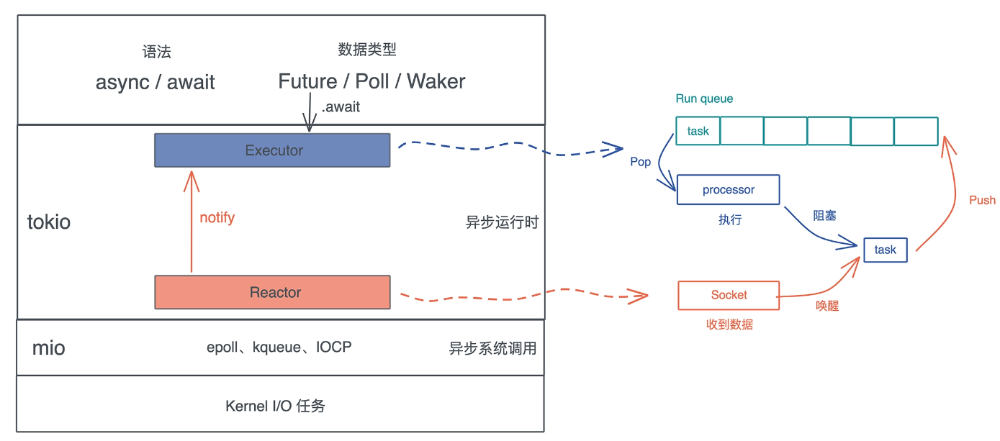
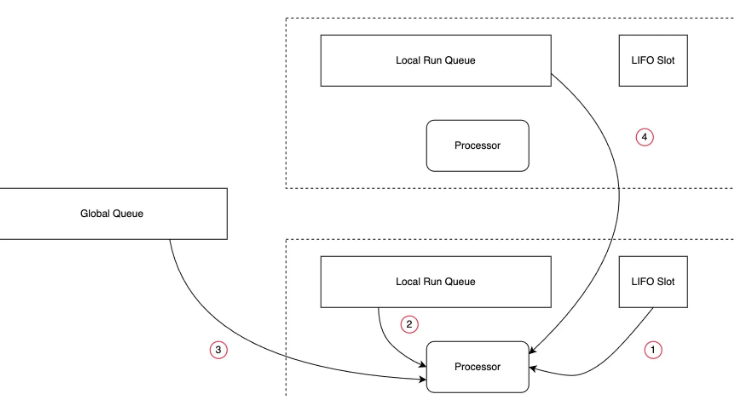
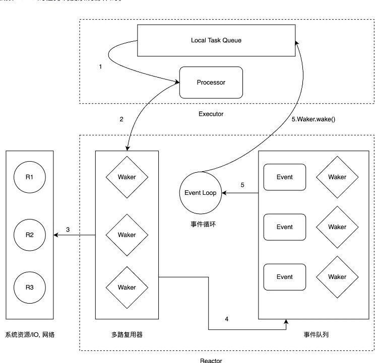

<!-- START doctoc generated TOC please keep comment here to allow auto update -->
<!-- DON'T EDIT THIS SECTION, INSTEAD RE-RUN doctoc TO UPDATE -->
**Table of Contents**  *generated with [DocToc](https://github.com/thlorenz/doctoc)*

- [tokio](#tokio)
  - [Tokio 的任务调度](#tokio-%E7%9A%84%E4%BB%BB%E5%8A%A1%E8%B0%83%E5%BA%A6)
  - [Tokio Reactor 模型](#tokio-reactor-%E6%A8%A1%E5%9E%8B)
  - [Tokio 的消息通道( channel )](#tokio-%E7%9A%84%E6%B6%88%E6%81%AF%E9%80%9A%E9%81%93-channel-)
    - [watch channel](#watch-channel)
    - [tokio::select!](#tokioselect)
  - [常见使用错误](#%E5%B8%B8%E8%A7%81%E4%BD%BF%E7%94%A8%E9%94%99%E8%AF%AF)
    - [std::sync::Mutex 和 tokio::sync::Mutex](#stdsyncmutex-%E5%92%8C-tokiosyncmutex)
  - [源码](#%E6%BA%90%E7%A0%81)
    - [task 抽象](#task-%E6%8A%BD%E8%B1%A1)
  - [参考](#%E5%8F%82%E8%80%83)

<!-- END doctoc generated TOC please keep comment here to allow auto update -->

# tokio

Tokio 的核心是一套 M:N 的协程 Runtime，下层通过 Rust 协程和 Mio 驱动，支撑上层的 HTTP / RPC 应用。

主要由以下组件构成：

- 多线程版本的异步运行时，可以运行使用 async/await 编写的代码
- 标准库中阻塞 API 的异步版本，例如thread::sleep会阻塞当前线程，tokio中就提供了相应的异步实现版本
- 构建异步编程所需的生态，甚至还提供了 tracing 用于日志和分布式追踪， 提供 console 用于 Debug 异步编程



## Tokio 的任务调度



Local Run Queue、 LIFO Slot、 Global Queue 都用于存储待处理的任务。Tokio Runtime 可以包含多个 Processor，
每个 Processor 都有自己的 Local Run Queue（Local Run Queue 的大小是固定的）和 LIFO Slot（目前 LIFO Slot 只能存放一个任务），所有的
Processor 共享 Global Queue。

Processor 获取 task 后，会开始执行这个 task，在 task 执行过程中，可能会产生很多新的 task，第一个新 task 会被放到 LIFO Slot
中，其他新 task 会被放到 Local Run Queue 中，因为 Local Run Queue 的大小是固定的，如果它满了，剩余的 task 会被放到 Global
Queue 中。

Processor 运行完当前 task 后，会尝试按照以下顺序获取新的 task 并继续运行：

1. LIFO Slot.
2. Local Run Queue.
3. Global Queue.
4. 其他 Processor 的 Local Run Queue。

## Tokio Reactor 模型



一个异步任务的处理过程为：

1. Processor 从 Task Queue 中获取一个 Task。
2. Processor 判断这个 Task 为异步任务（Task.future.poll（）返回 Pending），则将 Task 封装为 Waker，交给多路复用器。
3. 多路复用器监听系统事件。
4. 当事件出现时，多路复用器将事件和该事件对应的 Waker 交给事件队列。
5. 事件循环处理事件，调用 Waker.wake（）， 将 Task 重新放入 TaskQueue 中，待 Processor 处理

## Tokio 的消息通道( channel )

* mpsc, 多生产者，单消费者模式
* oneshot, 单生产者，单消费者，一次只能发送一条消息。一旦发送，channel就会关闭
* broadcast，多生产者，多消费者，其中每一条发送的消息都可以被所有接收者收到，因此是广播
* watch，单生产者，多消费者，只保存一条最新的消息，因此接收者只能看到最近的一条消息，例如，这种模式适用于配置文件变化的监听

少了一种类型：多生产者、多消费者，且每一条消息只能被其中一个消费者接收，如果有这种需求，可以使用 async-channel 包

### watch channel

watch channel 是一种可以发送多次消息的 channel。它的特点是可以有多个接收端，每个接收端都可以接收到发送端发送的最新消息。

watch channel 适用于以下场景：

- 线程之间需要传递多次消息。
- 线程之间需要订阅最新消息

### tokio::select!

tokio::select! 宏允许我们等待多个异步的任务，并在其中一个完成时返回。

select! 最多可以支持 64 个分支.

```shell
# 每个分支形式
<模式> = <async 表达式> => <结果处理>,
```

## 常见使用错误

### std::sync::Mutex 和 tokio::sync::Mutex

一个常见的错误无条件地使用 tokio::sync::Mutex ，而真相是：Tokio 提供的异步锁只应该在跨多个 .await调用时使用，而且 Tokio 的
Mutex 实际上内部使用的也是 std::sync::Mutex。

Tokio 提供的锁最大的优点就是：它可以在 .await 执行期间被持有，而且不会有任何问题。但是代价就是，这种异步锁的性能开销会更高

锁的使用有以下经验之谈：

- 锁如果在多个 .await 过程中持有，应该使用 Tokio 提供的锁，原因是
  .await的过程中锁可能在线程间转移，若使用标准库的同步锁存在死锁的可能性，例如某个任务刚获取完锁，还没使用完就因为 .await
  让出了当前线程的所有权，结果下个任务又去获取了锁，造成死锁
- 锁竞争不多的情况下，使用 std::sync::Mutex
- 锁竞争多，可以考虑使用三方库提供的性能更高的锁，例如 parking_lot::Mutex

## 源码

### task 抽象

任务状态

```rust
// tokio-1.40.0/src/runtime/task/state.rs
pub(super) struct State {
    val: AtomicUsize,
}
```

## 参考

- [探索 Tokio Runtime](https://juejin.cn/post/7307097620846837812)
- [tokio 1.5.0 解读](https://tony612.github.io/tokio-internals/02.html)