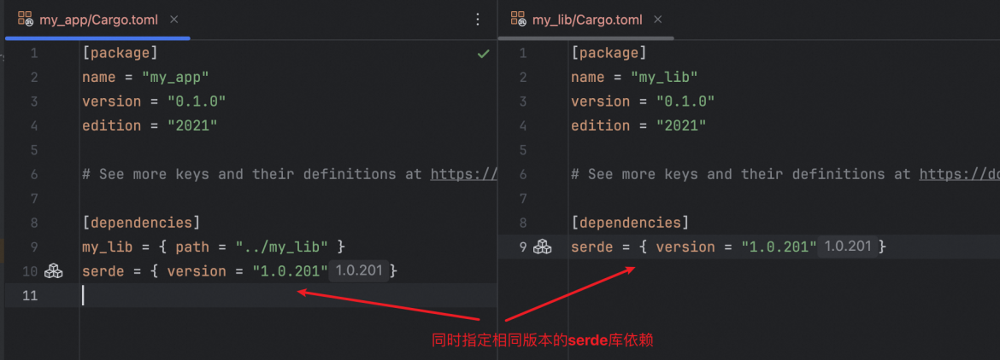

# workspace

> 若一个 Cargo.toml 有 [workspace] 但是没有 [package] 部分，则它是虚拟清单类型的工作空间。

## 依赖管理

my_app 依赖 my_lib, 这时候有个共同依赖 serde, 如果我们将my_lib的serde升级为一个新的版本，那么我们需要将my_app下的serde库也升级为新的版本。

## 参考

- [workspace共享依赖](https://www.cnblogs.com/w4ngzhen/p/18183529)